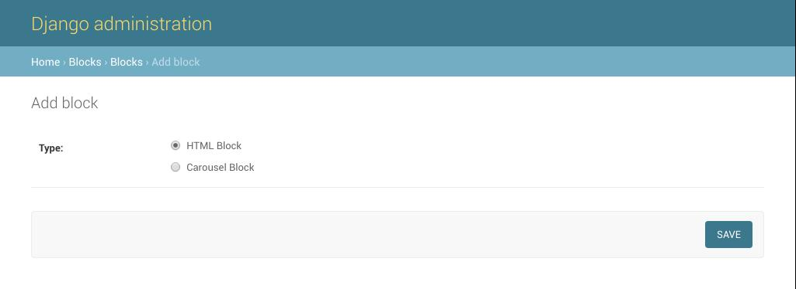
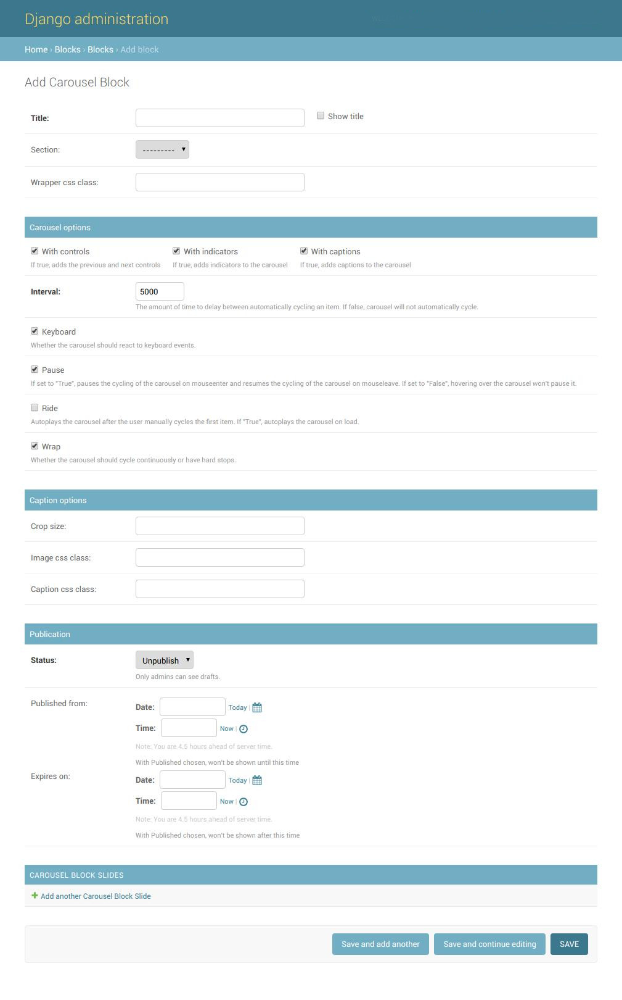
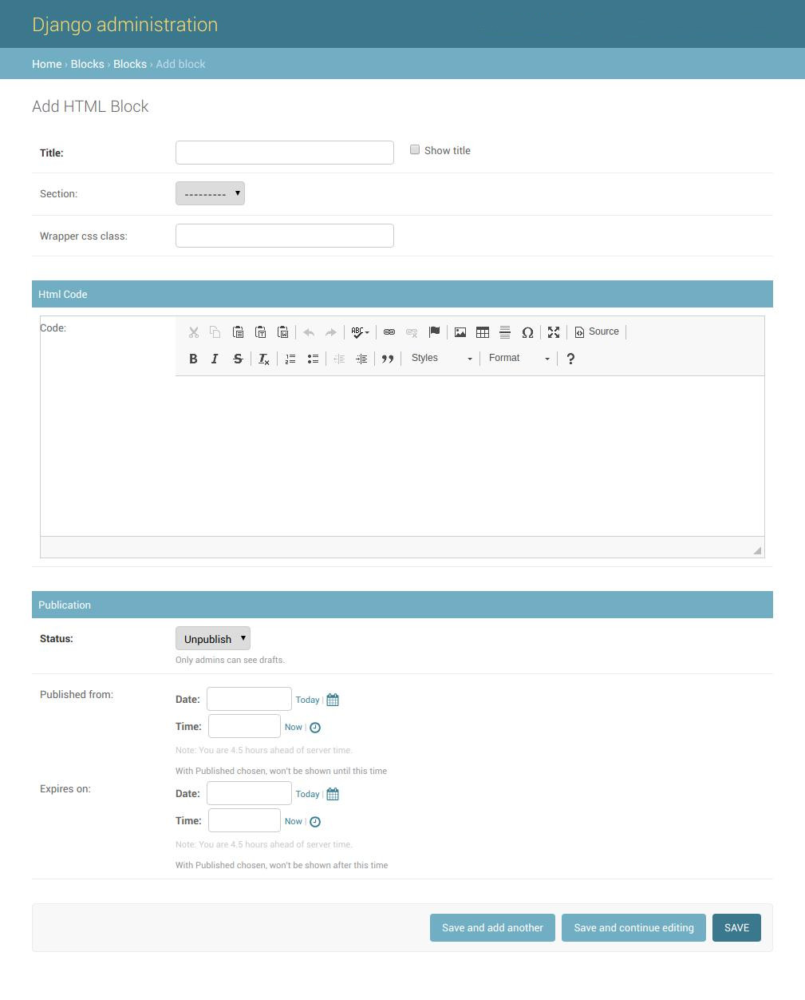

.. _blocks:

Blocks
======
On this page you can view all the predefined sub-blocks in django-blocks
package. All the blocks defined in ``BLOCKS_APPS`` will be displayed as a type
and when you save the type on the next screen you will be presented with
actual admin panel.

.. _alert-block:

Alert Block
-----------

Refer to `bootstrap 4 alerts docs
<https://getbootstrap.com/docs/4.1/components/alerts//>`_
to get more information on Alert options.

.. _carousel-block:

Carousel Block
--------------

Refer to `bootstrap 4 carousel docs
<https://getbootstrap.com/docs/4.0/components/carousel/#options/>`_
to get more information on Carousel options.

.. _html-block:

HTML Block
----------

